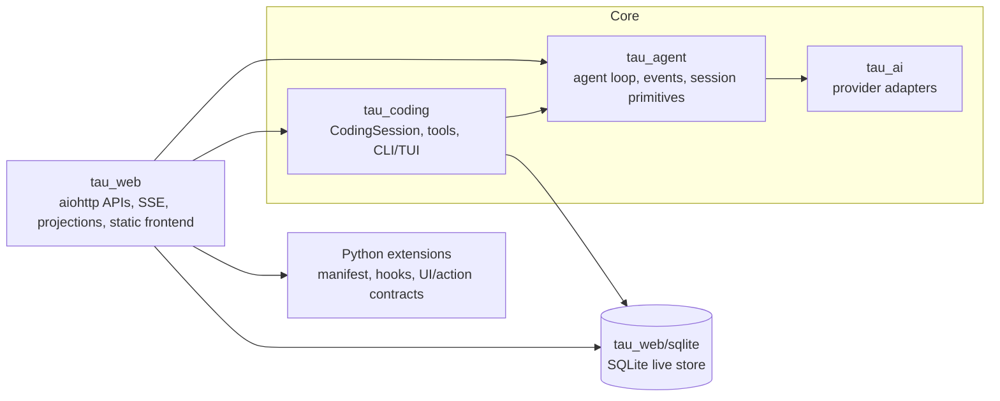

# Architecture

Tau is intentionally layered: provider adapters stay separate from agent logic, and agent logic stays separate from coding-app and web-host concerns.

## Layers

- `tau_ai`: streaming model/provider adapters normalized into Tau provider events.
- `tau_agent`: the reusable core agent loop, tool orchestration, event stream, and session primitives.
- `tau_coding`: the coding application layer built around `CodingSession`, prompt/context assembly, compaction policy, tools, and CLI/TUI surfaces.
- `tau_web`: the aiohttp host runtime exposing APIs, SSE, durable projections, and the static browser frontend.
- Extension contracts are Python-first: manifests, backend hooks, actions, and UI descriptors are discovered and enforced by the host runtime.

The core dependency direction is one-way: `tau_coding -> tau_agent -> tau_ai`. `tau_web` composes those layers as a runtime host, not as a new core.

## Live storage model

SQLite under `tau_web/sqlite` is the **sole live durable store**.

- Sessions, entries, runs, queues, projections, usage, media metadata, extension state, and audit data persist there.
- One process owns the writer role via a lock; reads use pooled read-only connections.
- JSONL is for import/export or interchange, never the live runtime source of truth.
- Compaction changes active working context, not append-only historical facts.

## Runtime model

`CodingSession` is the per-session execution wrapper around the core agent harness. It owns durable session loading, prompt submission, context refresh, tool wiring, compaction, and extension dispatch.

`AsyncAgentPool` is the multi-session scheduler.

- Per-session turns are serialized with a session-local lock.
- Global concurrency is bounded with a shared semaphore.
- Event streams are bounded and cancellable.
- Shutdown is cooperative and deterministic.

A durable runtime layer bridges pool activity to persisted `session_runs`, queue state, and projected web events.

## Web and frontend model

`tau_web` exposes aiohttp APIs plus SSE projections over the same session/runtime model used by the CLI/TUI.

- REST endpoints mutate/query durable state.
- `/api/events` streams projected agent/runtime events as SSE.
- Event delivery uses monotonic cursors and supports replay via `Last-Event-ID`.
- If a cursor cannot be replayed safely, the server falls back to a snapshot event.
- Heartbeats and bounded client buffers protect server health.

The browser UI is a static frontend shell served by `tau_web`.

- Static assets bootstrap the app.
- The UI reads state through `/api/*`.
- Live updates arrive through SSE.
- Extension surfaces can mount declarative UI, sandboxed widgets, or trusted modules depending on trust tier.

## Extension contracts and trust tiers

Tau supports Python extension contracts for backend behavior and UI/action integration, with three trust tiers:

1. **Declarative / low trust**: typed views, components, and actions validated by the host.
2. **Sandboxed widget / medium trust**: isolated document plus message bridge, CSP, and bounded payloads.
3. **Trusted frontend / high trust**: same-origin built-in or admin-approved modules with stronger integrity and source controls.

Trust policy is enforced by source, permissions, allowlists, and approval state; workspace code does not automatically become trusted frontend code.

## Turn flow

1. A client submits a prompt through CLI/TUI or the web API.
2. The runtime resolves the target session and submits work to `AsyncAgentPool`.
3. The pool acquires the per-session lock and a global execution slot.
4. `CodingSession` runs the turn through the core agent harness and streams events.
5. The runtime persists run state and append-only session records.
6. `tau_web` projects canonical events and publishes them to SSE subscribers.
7. The run reaches a terminal state and the session lock is released.

## Cross-session flow

1. A source session emits a delivery or steer request for another session.
2. The router validates target, idempotency, rate, and hop/cycle constraints.
3. The delivery is durably recorded before dispatch.
4. Depending on mode, the target session is auto-run, queued for follow-up, or steered into an active run.
5. Receipt and reconciliation update delivery status to a terminal success or failure state.

## Recovery and shutdown invariants

Startup and recovery invariants:

- Acquire the DB/process lock before opening the live store.
- Apply migrations and integrity checks before serving traffic.
- Recover stale `running` work into an interrupted state.
- Start writer, read pool, runtime, and SSE broker only after storage is ready.

Shutdown invariants:

- Stop accepting new work before draining background activity.
- Cancel or drain pool tasks cooperatively.
- Flush/close projections, broker, sessions, and DB handles in order.
- Release the lock only after durable state is consistent.

## Security invariants

- **Process boundary**: sandboxing constrains agent and tool subprocess capabilities.
- **HTTP boundary**: aiohttp middleware owns auth, origin/CSRF policy, structured errors, and security headers.
- **Extension boundary**: manifests, permissions, trust tier, and approval state are enforced by the host.
- **Data boundary**: SQLite lock ownership, file permissions, and audit trails protect durable state.

## Related docs

- [storage](./storage.md)
- [web](./web.md)
- [extensions](./extensions.md)
- [sandboxing](./sandboxing.md)
- [compaction](./compaction.md)
